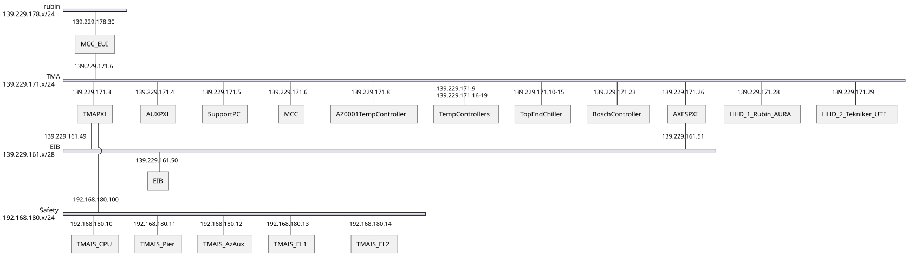

# Ethernet Connections

| Requested by: | **GHESA**  |
| ------------- | ---------- |
| Code          | Doc. Code  |
| Editor:       | A. Izpizua |
| Approved by:  | J. Garcia  |

## Introduction

This document describes the network architecture designed for the MCS developed by Tekniker. This document does not cover
any other networks bellow this architecture, as these are not developed by Tekniker.

## Reference document list

| **No.** | **DOCUMENT**                     | **CODE**      | **VERSION** |
| ------- | -------------------------------- | ------------- | ----------- |
| **1**   | MCS Design Electrical Schematics | 3151_MCS_0022 | 9.0         |

## Network topology

The network topology is shown in the next diagram. This network is implemented using the IE3200 and IE3000 CISCO switches.

## Components and descriptions

### MCC

This is the computer located in the server room and hosts the EUI. It has two Network Interface Cards (NIC), one is dedicated
to the local (Rubin) network and the other to connect to the telescope network.

### Cisco IE3000 and IE3200

These are two switches located inside the TMA-AZ-CS-CBT-0001 cabinet. The IE3000 is connected to the MCC using a fiber
optics line and the IE3000 has a trunk port connected to the IE3200.

### TMA PXI, AuxPXI and AxesPXI

They are the different controllers used in the MCS. They have several NICs to connect to different VLANs, after switching
to the networks proposed by Rubin, some of the NICs are now unused.

### EIB

Encoder controller.

### HHD

It is a Hand Held Device, portable user interface, that can be connected only in some points in the telescope, 4 boxes.
Only one connection is used each time.

### TMA IS

It is the PILZ controller for the TMA interlock and safety functions. It is connected to the safety network.

### Bosch Rexroth drive controller

This controller manages all the auxiliary drives in the TMA, known as Bosch drives.

### Temperature controllers

There are several temperature controllers for cabinets. Those are managed by the MCS via modbus protocol.

### Top end chiller

PLC located in the telescope top end. It manages the cooling system of the top end.

### OSS

Oil supply system controller located in level 1.

### Phase support PC

It is a PC located in TMA-AZ-DR-CBT-0001 cabinet. The connection to the IE3200 was made by Rubin IT.

### Support PC

This is a support PC provided by Tekniker. It is used for engineering purposes. This PC is linked to the 139.229.171.0/24
network and to the wireless Rubin network. Originally this PC was installed by Tekniker in level 6, but it was relocated
by Rubin staff after Tekniker's departure, at the time of writing this, it was located at the TMA Azimuth platform.

In level 6 there is a switch that allows the connection of other elements for diagnosis. It was the point where Alberto
and Julen connected their laptops when they were at the summit.

## List of macs and IPs

### MCC interfaces

#### Old CentOS Server

This computer has 2 NICs one connected to Rubin network and the other to TMA private network.

| Network | MAC               | IP             | FQDN                           |
| ------- | ----------------- | -------------- | ------------------------------ |
| Rubin   | 00:1b:1b:c3:9b:33 | 139.229.178.30 | tma-controller-old.cp.lsst.org |
| TMA     | 00:1b:1b:f4:58:76 | 139.229.171.6  | currently DOWN                 |

#### Alma 9 server

This computer has 2 NICs one connected to Rubin network and the other to TMA private network.

| Network | MAC               | IP             | FQDN                         |
| ------- | ----------------- | -------------- | ---------------------------- |
| Rubin   | 00:1b:1b:c3:9b:33 | 139.229.178.25 | tma-controller01.cp.lsst.org |
| TMA     | 90:5a:08:a8:e3:7d | 139.229.171.29 | tma-comm01.cp.lsst.org       |

### IE3200 switch

| Switch port | Element             | MAC               | IP             | FQDN                         |
| ----------- | ------------------- | ----------------- | -------------- | ---------------------------- |
| 1           | Rubin network fiber |                   |                |                              |
| 2           | Rubin network fiber |                   |                |                              |
| 3 [^1]      | Support PC          |                   |                |                              |
| 4           | TMA PXI             | 00:80:2f:41:e9:e6 | 139.229.171.3  | tma-tma-pxi.cp.lsst.org      |
| 5           | IE3000              |                   |                |                              |
| 6           | TMA PXI (VLAN 213)  | 00:02:25:03:38:2b | down           |                              |
| 7           | AXES PXI (VLAN 213) | 00:80:2f:38:5d:67 | 139.229.171.26 | tma-axes-pxi.cp.lsst.org     |
| 8           | TMA PXI (VLAN 1610) | 00:02:25:03:38:3A | 139.229.161.49 | tma-tma-pxi-eib.cp.lsst.org  |
| 9           | AXES PXI (VLAN 211) | 00:02:25:03:77:2A | 139.229.161.51 | tma-axes-pxi-eib.cp.lsst.org |
| 10          | EIB                 | 00:A0:CD:10:0E:64 | 139.229.161.50 | tma-eib.cp.lsst.org          |

### IE3000 switch

| Switch port | Element                                                | MAC               | IP              | FQDN                                |
| ----------- | ------------------------------------------------------ | ----------------- | --------------- | ----------------------------------- |
| Gi1/1       | IE3200                                                 |                   |                 |                                     |
| Gi1/2       | AuxPXI (VLAN 209)                                      | 00:01:05:8f:b1:71 | 139.229.171.4   | tma-aux-pxi.cp.lsst.org             |
| Fa1/1       | HHD (HHD_2 Tekniker-UTE) [^5]                          | 00:01:29:60:56:74 | 139.229.171.30  | tma-hand-held-device01.cp.lsst.org  |
| Fa1/2       | HHD (HHD_2 Tekniker-UTE) [^5]                          | Same as Fa1/1     | Same as Fa1/1   |                                     |
| Fa1/3       | HHD (HHD_2 Tekniker-UTE) [^5]                          | Same as Fa1/1     | Same as Fa1/1   |                                     |
| Fa1/4       | HHD (HHD_2 Tekniker-UTE) [^5]                          | Same as Fa1/1     | Same as Fa1/1   |                                     |
| Fa1/5       | TMA PXI Chassis                                        | 00:80:2F:38:6A:3E | 139.229.171.156 | tma-tma-pxi-chassis.cp.lsst.org     |
| Fa1/6       | Free                                                   |                   |                 |                                     |
| Fa1/7       | TMA PXI (VLAN 180)                                     | 00:02:25:03:38:2a | 192.168.180.100 | TBD                                 |
| Fa1/8       | TMA IS                                                 | 00:02:48:44:5b:d4 | 192.168.180.10  | TBD                                 |
| Fa2/1       | TMA PXI (VLAN 212)                                     | 00:02:25:03:38:0a | down            |                                     |
| Fa2/2       | Bosch-Rexroth drives Controller                        | 00:30:d6:2d:8e:24 | 139.229.171.23  | tma-bosch-controller.cp.lsst.org    |
| Fa2/3       | AuxPXI (VLAN 210)                                      | 00:01:05:6d:22:b7 | 192.168.210.10  | tma-aux-pxi-oss.cp.lsst.org         |
| Fa2/4       | CS-CBT-0001 temperature controller                     | 00:03:aa:00:97:d6 | 139.229.171.8   | tma-temp-cbt0001.cp.lsst.org        |
| Fa2/5       | Phase Main Cabinet temperature controller              | 00:90:E8:68:57:79 | 139.229.171.9   | tma-temp-phase.cp.lsst.org          |
| Fa2/6       | AZ-PD-CBT-0001 temperature controller                  | 00:90:E8:68:57:76 | 139.229.171.16  | tma-temp-az-cbt-0001.cp.lsst.org    |
| Fa2/7       | EL-PD-CBT-0001 temperature controller                  | 00:90:E8:68:57:92 | 139.229.171.17  | tma-temp-el-cbt-0001.cp.lsst.org    |
| Fa2/8       | EL-PD-CBT-0002 temperature controller                  | 00:90:E8:68:57:35 | 139.229.171.18  | tma-temp-el-cbt-0002.cp.lsst.org    |
| Fa3/1       | AZ-PD-TRM-0001 temperature controller                  | 00:90:E8:68:57:8C | 139.229.171.19  | tma-temp-az-trm-0001.cp.lsst.org    |
| Fa3/2 [^2]  | Top End Chiller                                        |                   | 139.229.171.10  | tma-tec01.cp.lsst.org               |
| Fa3/2 [^2]  | Top End Chiller                                        |                   | 139.229.171.11  | tma-tec02.cp.lsst.org               |
| Fa3/2 [^2]  | Top End Chiller                                        |                   | 139.229.171.12  | tma-tec03.cp.lsst.org               |
| Fa3/2 [^2]  | Top End Chiller                                        |                   | 139.229.171.13  | tma-tec04.cp.lsst.org               |
| Fa3/2 [^2]  | Top End Chiller                                        |                   | 139.229.171.14  | tma-tec05.cp.lsst.org               |
| Fa3/2 [^2]  | Top End Chiller                                        |                   | 139.229.171.15  | tma-tec06.cp.lsst.org               |
| Fa3/3 [^3]  | OSS                                                    |                   | 192.168.210.50  | tma-oss01.cp.lsst.org               |
| Fa3/4       | Switch 1000                                            |                   |                 |                                     |
| Fa3/5       | Phase support PC                                       | 00-18-7D-9E-93-1E | 139.229.171.2   | tma-phase-support-pc.cp.lsst.org    |
| Fa3/6       | TODO: PLC1 - David Jimenez                             | TODO:             | TODO:           | TODO:                               |
| Fa3/7       | TODO: tekniker-pc-gis                                  | TODO:             | TODO:           | TODO:                               |
| Fa3/8 [^4]  | Possible connection for the Support PC when is level 8 | 00:13:3B:5B:23:E4 | 139.229.171.5   | tma-tekniker-support-pc.cp.lsst.org |

### Switch 1000

| Switch port | Element                     | MAC | IP             | FQDN                            |
| ----------- | --------------------------- | --- | -------------- | ------------------------------- |
| 1           | Connection to IE3000 switch |     |                |                                 |
| 2           | Rubin TMA Support PC        |     | 139.229.171.24 | tma-support-pc.cp.lsst.org      |
| 3           | Web relay 1                 |     | 139.229.171.25 | tma-pilz-webrelay01.cp.lsst.org |
| 4           | Web relay 1                 |     | 139.229.171.27 | tma-pilz-webrelay02.cp.lsst.org |

## Protocols in the network

TCP, UPD and SSH.

## Devices with remote access and what protocol being used to access

There are 2 elements with remote access at this moment:

- MCC. VNC connection over ssh over VPN.
- Support PC. Teamviewer.

## List of users with remote access enabled

- Julen Garcia
- Alberto Izpizua

## VLANs (DEPRECATED, now managed by Rubin IT)

The VLANs listed here are from the original design when the switches were managed by Tekniker, the current approach is different and managed by Rubin IT.

### 192.168.209.X

Main MCS network.

### 192.168.210.X

Network for modbus slaves.

### 192.168.211.X

Network for encoder system.

### 192.168.212.X

Network for auxiliary axes communications.

### 192.168.213.X

Network for AXES PXI communications.

### 192.168.180.X

Safety network.

[^1]: In this port also Julen's and Alberto`s laptops are connected when they are in level 6. Julen's mac: 34-48-ED-15-CC-F3. Alberto's mac: 34:48:ed:4a:68:7c

[^2]: There is an additional switch not managed by Tekniker. The IPs are the listed ones

[^3]: There is an additional switch not managed by Tekniker. Tekniker does not know about the elements in the switch or the switch configuration.

[^4]: This is the same PC as the one connected in the IE3200 port 3. It is used when for any reason the PC is in level 8. This port could also be used.

[^5]: This could also be the Rubin HHD: 139.229.171.31 MAC: 00:01:29:96:0a:a4
