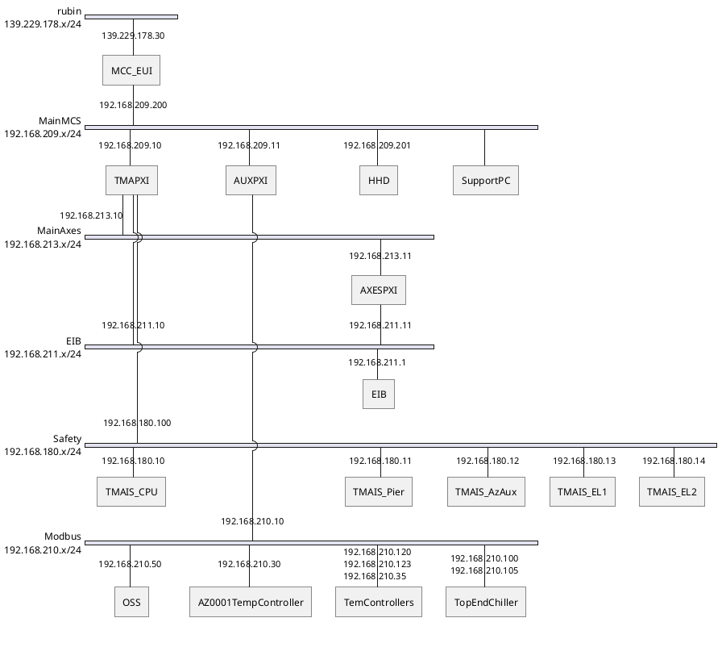

# TMA ETHERNET CONECTIONS

| Requested by: | **GHESA** |
| --- | --- |
| Code  | Doc. Code  |
| Editor: | A. Izpizua |
| Approved by: | J. Garcia |

## Introduction

This document describes the network system designed for MCS developed by Tekniker. This document does not cover any other network bellow the Tekniker's network but it is not developed by Tekniker.

## Reference document list

| **No.** | **DOCUMENT** | **CODE** | **VERSION** |
|---------|--------------|----------|-------------|
| **1**   |MCS Design Electrical Schematics|3151_MCS_0022|9.0|

## Network topology

The network topology is shown in the next diagram. The MCC computer will be access point to the MCS network. To implement the networks the IE3200 and IE3000 CISCO switched are used.

## Components and descriptions

### MCC

This is the computer located in the server room and hosts the EUI. It has two nic, one is dedicated to the local VPNs and the other to connect to the telescope network

### Cisco IE3000 and IE3200

These are two switches located in the TMA-AZ-CS-CBT-0001 cabinet. The IE3000 is connected to the MCC using the fiber optics line. IE3200 has a trunk port connected to IE3000.

### TMA PXI, AuxPXI and AxesPXI

They are the different controllers used in the MCS. They have several nic to connect to different VPNs.

### EIB

Encoder controller

### HHD

It is a portable user interface that can be connected only in some points in the telescope. It has 4 connection points available in the switch but it uses only one each time.

### TMA IS

It is the PILZ controller for the TMA interlock and safety functions. It is connected to the safety network.

### Bosch Rexroth drive controller

This is controller to manage all the auxiliary drives in the TMA.

### Temperature controllers

There are several temperature controllers for cabinets. Those are managed by MCS using modbus protocol.

### Top end chiller

PLC located in the telescope top end. It manages the cooling system of the top end.

### OSS

Oil supply system controller located in level 1.

### Phase support PC

It is a PC located in TMA-AZ-DR-CBT-0001 cabinet. The connection to the IE3200 was made by Rubin IT.

### Support PC

It is the PC located in level 6. It is used for engineering purposes. This PC is linked to the VPN209 and to the wireless Rubin network.

In level 6 there is a switch that allows the connection of other elements for diagnosis. It was the point where Alberto and Julen connects their laptops when they were in the submit.

## VLANs

### 168.209.X

Main MCS network

### 168.210.X

Used for modbus slaves

### 168.211.X

Used for encoder system

### 168.212.X

Auxiliary axes system

### 168.213.X

Main axes network

### 168.180.X

Safety network.

## Protocols in the network

TCP, UPD and SSH.

## Devices with remote access and what protocol being used to access

There are 2 elements with remote access at this moment.

MCC. VNC connection over ssh over VPN.

Support PC. Teamviewer.

## List of users with remote access enabled

Julen Garcia

Alberto Izpizua

## List of macs and IPs

### MCC

This computer has 2 NICs one connected to Rubin network and the other to TMA private network.

| Network | MAC | IP |
| --- | --- | --- |
| Rubin | 00:1b:1b:c3:9b:33 | 139.229.178.30 |
| TMA | 00:1b:1b:f4:58:76 | 192.168.209.200 |

### IE3200 switch

| Switch port | Element | MAC | IP |
| - | --- | --- | --- |
| 1 | MCC | 00:1b:1b:f4:58:76 | 192.168.209.200 |
| 2 | | | |
| 3 [^1] | Support PC | 00:13:3B:5B:23:E4 | 192.168.209.130 |
| 4 | TMA PXI (VLAN 209) | 00:80:2f:23:aa:3d | 192.168.209.10 |
| 5 | IE3000 | | |
| 6 | TMA PXI (VLAN 213) | 00:02:25:03:38:2b | 192.168.213.10 |
| 7 | AXES PXI (VLAN 213) | 00:80:2f:23:eb:99 | 192.168.213.11 |
| 8 | TMA PXI (VLAN 211) | 00:02:25:03:38:3A | 192.168.211.10 |
| 9 | AXES PXI (VLAN 211) | 00:02:25:03:77:2A | 192.168.211.11 |
| 10 | EIB | 00.A0.CD.10.0E.64 | 192.168.211.1 |

### IE3000 switch

| Switch port | Element | MAC | IP |
| --- | --- | --- | --- |
| Gi1/1 | IE3200 | | |
| Gi1/2 | AuxPXI (VLAN 209) | 00:01:05:6d:22:b7 | 192.168.209.11 |
| Fa1/1 | HHD | 00:01:29:60:56:74 | 192.168.209.201 |
| Fa1/2 | HHD | Same as Fa1/1 | Same as Fa1/1 |
| Fa1/3 | HHD | Same as Fa1/1 | Same as Fa1/1 |
| Fa1/4 | HHD | Same as Fa1/1 | Same as Fa1/1 |
| Fa1/5 | TMA PXI Chassis | 00:80:2F:23:06:75 | 192.168.209.1 |
| Fa1/6 | Free | | |
| Fa1/7 | TMA PXI (VLAN 180) | 00:02:25:03:38:2a | 192.168.180.100 |
| Fa1/8 | TMA IS | 00:02:48:44:5b:d4 | 192.168.180.10 |
| Fa2/1 | TMA PXI (VLAN 212) | 00:02:25:03:38:0a | 192.168.212.10 |
| Fa2/2 | Bosch-Rexroth drives Controller | 00:30:d6:13:68:32 | 192.168.212.3 |
| Fa2/3 | AuxPXI (VLAN 210) | 00:01:05:6d:22:b6 | 192.168.210.10 |
| Fa2/4 | CS-CBT-0001 temperature controller | 00:03.aa:00:97:d6 | 192.168.210.30 |
| Fa2/5 | Phase Main Cabinet temperature controller | 00:90:E8:68:57:79 | 192.168.210.35 |
| Fa2/6 | AZ-PD-CBT-0001 temperature controller | 00:90:E8:68:57:76 | 192.168.210.120 |
| Fa2/7 | EL-PD-CBT-0001 temperature controller | 00:90:E8:68:57:92 | 192.168.210.121 |
| Fa2/8 | EL-PD-CBT-0002 temperature controller | 00:90:E8:68:57:35 | 192.168.210.122 |
| Fa3/1 | AZ-PD-TRM-0001 temperature controller | 00:90:E8:68:57:8C | 192.168.210.123 |
| Fa3/2 [^2] | Top End Chiller | | 192.168.210.100-105 |
| Fa3/3 [^3]| OSS | | 192.168.210.50 |
| Fa3/5 | Phase support PC | 00-18-7D-9E-93-1E | DHCP |
| Fa3/8 [^4]| Possible connection for the Support PC when is level 8 | 00:13:3B:5B:23:E4 | 192.168.209.130 |

[^1]: In this port also Julen's and Alberto`s laptop are connected when they are in level 6. Julen's mac: 34-48-ED-15-CC-F3. Alberto's mac: 34:48:ed:4a:68:7c

[^2]: There is an additional switch not managed by Tekniker. The IPs are the listed ones

[^3]: There is an additional switch not managed by Tekniker. Tekniker does not know elements in the switch or the switch configuration.

[^4]: This is the same PC as the one connected in the IE3200 port 3. It is used when for any reason the PC is in level 8. This port could also be used.
